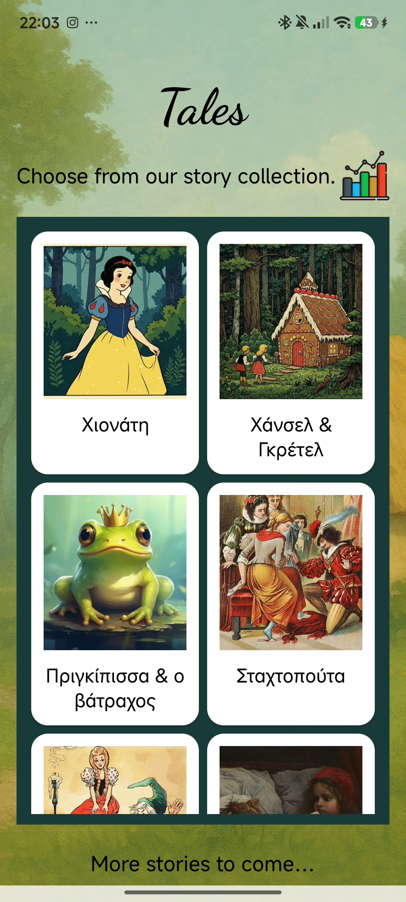

# 📚 Talescast  
_Classic fairytales, beautifully narrated._

---

**Talescast** is a storytelling app that brings the magic of Grimm Brothers’ fairytales to life through immersive narration and elegant design. Whether you enjoy listening or reading, Talescast creates a cozy space to explore beloved stories.

---

## 🌟 What You Can Do

### 🎧 Listen to Narrated Tales  
Tap a story and hit play — the app will read the tale out loud while showing the text on screen. You can follow along sentence by sentence with the help of highlighted narration.

### 📖 Read Along Visually  
Prefer reading? Every story comes with clean, readable text in both light and dark environments, with options for styling and spacing.

### ⏯️ Control the Narration  
Use the built-in **seek bar** to move forward or backward through the story. The narration will pick up from wherever you leave off.

### 📊 Track Your Activity  
Talescast tracks which stories you’ve listened to or read. You can view personal stats like:
- Most recently played tale
- Stories played vs. read
- Graphs showing your interaction history

### 🔐 Safe & Personalized  
Sign up with your email to securely save your progress and preferences. Your activity is tied to your account and synced across sessions.

---

## 🧭 App Overview

Here’s what to expect when navigating the app:

- **Home Screen:** Enter your credentials and get started  
- **Story Library:** Browse a selection of classic tales  
- **Player Screen:** Listen, read, and interact with the story  
- **Stats Screen:** See your reading/listening history with charts  

---

## 🌍 Language Support

Talescast supports:
- 🇬🇷 Greek

---

## 🧑‍💻 Created By

This app was designed and built by MSc Informatics students as part of an academic project:

**Sarantidis Romanos** (MPPL2327)

---

## 📸 Interface

---

Thanks for exploring Talescast — enjoy the stories!
